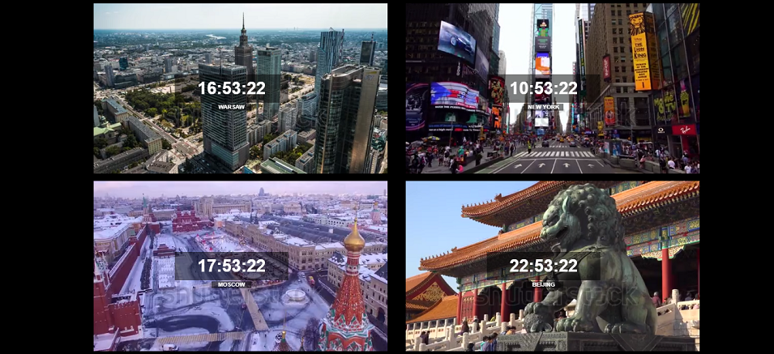

### TIMEZONES by [@Maciekbe89](http://github.com/Maciekbe89)!
---

### Hello

Simple page with time zones for four cities.

:clock5: Warsaw
:clock11: New York
:clock6: Moscow
:clock11: Beijing

The time is visible on video's. I created that in vanilla javascript.

 

### design:
